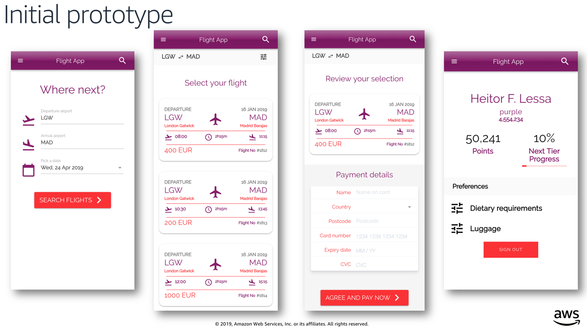

## Full Stack Airline Booking Application
## AWS Serverless Web Application

Web Application Functionality:
Flight Search
Flight Payment
Flight Booking
Flight Preferences
Loyalty points

#### Technology Stack
AWS Lambda
AWS Amplify
AWS AppSync
AWS SAM
Amazon API Gateway
Amazon Cognito
Amazon DynamoDB
#### Backend Services
GraphQL
#### End to end testing
CI/CD. 

###Inspiration

## License Summary

This sample code is made available under the MIT-0 license. See the LICENSE file.
